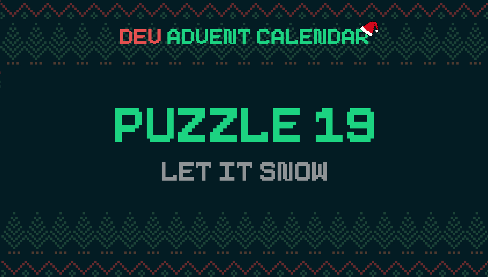

ℹ️ For detailed information about the contest, check out [devadvent/readme](https://github.com/devadvent/readme/)

# Dev Advent Calendar 🎅 Puzzle 19 - Let It Snow ☃️

> This puzzle will be less a puzzle and more a challenge. It will be different from the JavaScript puzzles before 😉

It's very close to Christmas, and there is not that much snow yet in the cities around the world.

Make it snow ❄️

## 💪 The challenge

**Add snow to this site**

In the file [index.html](index.html) there is basic site with a red background. Add some animated snow to the site. You can be creative as you want.
Write your CSS code in [style.css](style.css) (in the container `.snow`).

### Rules

-   Don't just copy entire projects from the Internet

## 🚢 Ship your solution

Check out the [contributing guide](https://github.com/devadvent/readme/blob/main/CONTRIBUTING.md) for details about how to participate.

In short:

-   ✨ Create your repository by [acceping the assignment](https://classroom.github.com/a/5ri8w-60) using the participation link
-   💪 Solve the challenge
-   🐦 Add your Twitter handle to `twitter.js`
-   🤖 Test your solution
-   🚀 Upload your changes to the `main` branch

## 🔗 Participation link

In order to participate, you need to enter the following link and accept the assignment:
[https://classroom.github.com/a/5ri8w-60](https://classroom.github.com/a/5ri8w-60)

## 💻 Use this project

### ⏳ Install the dependencies

Install the dependencies with

```bash
yarn install
```

or

```bash
npm install
```

### ⚙️ Run the code

Run the code with

```bash
yarn dev
```

or

```bash
npm run dev
```

### 🤖 Test your solution

This puzzle is equipped with automated tests (in the `./tests` folder). In order for your solution to qualify for winning the daily prize, **all** tests need to pass.

To run these tests, execute one of the following commands in your console:

```bash
yarn test
```

or

```bash
npm test
```
